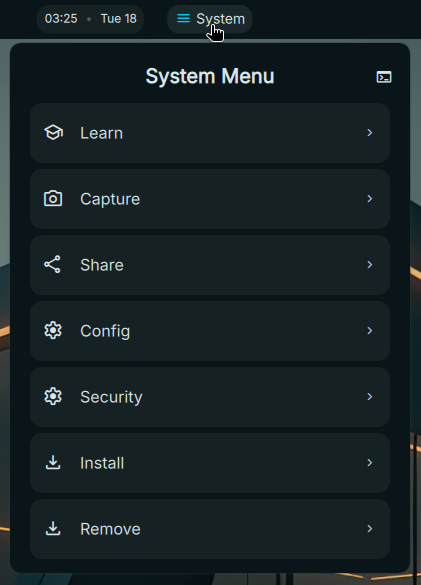

# DMS System Menu

    
    

Docker container monitoring and management plugin for [DankMaterialShell](https://danklinux.com/)

Inspired by [Omarchy Walker Menu](https://github.com/basecamp/omarchy/)

A compact System Menu plugin and helper scripts for quick system tasks (screenshots, screen recording, sharing, package actions, updates, and more).

This repository contains the UI/Qt Quick parts of the plugin and a set of helper shell scripts in `bin/` that the plugin can invoke.

## Features

- Compact panel/plugin providing common actions (install, update, power, screenshots, screenrecord, share, editor, terminal shortcuts).
- Helper scripts in `bin/` for Wayland-friendly screenshots/screen recording and Hyprland integration.
- Simple installer script to copy scripts into a per-user bin directory and make them executable.

## Machine requirements

- Grub bootloader (if using the setup features listed here)
- Btrfs filesystem (recommended for snapshot workflows)
- snapper (optional - used for snapshot capture)

## Recommended packages

- gum (CLI UI helper)
- localsend (file sharing)
- plocate
-fzf

Other optional dependencies used by scripts (Wayland-focused): `grim`, `slurp`, `wl-copy`, `wf-recorder`, `fzf`, `hyprctl`, `hypridle`, and a terminal emulator such as `kitty` or `alacritty`.

## Installation

1. Easiest: run the provided installer script from the repository root. It copies scripts from `bin/` to `~/.local/share/dms-sm-plugin/bin` and attempts to make them executable:

	./dms-sm-setup.sh

	The installer will warn if the install directory is not on your PATH and will try to install a few optional packages on Arch systems (via `pacman`).

2. Manual (alternate): copy the `bin/` folder contents to a location in your PATH or to your systemMenu script location (for example `~/.config/systemMenu/scripts/`) and ensure they are executable.

	mkdir -p ~/.local/share/dms-sm-plugin/bin
	cp bin/* ~/.local/share/dms-sm-plugin/bin/
	chmod +x ~/.local/share/dms-sm-plugin/bin/*

3. Make sure the chosen install directory is in your PATH so the plugin can invoke the helper scripts.

## Usage

- The plugin UI files are: `SystemMenuWidget.qml`, `SystemMenuService.qml` and `SystemMenuSettings.qml`.
- From the Settings (`SystemMenuSettings.qml`) you can choose the terminal application (`terminalApp`) and enable the setup/download popout (use the topleft download button in the popout to install scripts).
- For Hyprland users: add a floating config entry with title `^DMS_SM$` as noted in the settings UI so the menu floats correctly.

## Included helper scripts (in `bin/`)

The repository's `bin/` folder contains the following helper scripts (brief categories):

- dms-sm-cmd-missing — helper to report missing commands/dependencies
- dms-sm-editor — open an editor with a file
- dms-sm-launch-editor — launch a configured editor
- dms-sm-launch-terminal — open a terminal
- dms-sm-pkg-add — package helper (add)
- dms-sm-pkg-aur-accessible — AUR accessibility helper
- dms-sm-pkg-aur-install — install packages from AUR
- dms-sm-pkg-install — install packages
- dms-sm-pkg-missing — detect missing packages
- dms-sm-pkg-present — check package presence
- dms-sm-pkg-remove — remove package
- dms-sm-present — present/announce a message
- dms-sm-screenrecord — screen recording helper (wf-recorder)
- dms-sm-screenshot — take screenshots (grim/slurp)
- dms-sm-setup-apparmor — apparmor setup helper
- dms-sm-setup-dns — dns setup helper
- dms-sm-setup-secureboot — secureboot setup helper
- dms-sm-share — share files/clipboard (localsend)
- dms-sm-show-done — quick notification helper
- dms-sm-show-logo — show logo helper
- dms-sm-snapshot — create snapshots (Btrfs/snapper)
- dms-sm-terminal — open terminal helper
- dms-sm-update — update helper
- dms-sm-update-firmware — firmware update helper
- dms-sm-update-perform — perform update
- dms-sm-update-plugin — update plugin helper

For details about each script and their options, see `bin/README.md` which documents usage and dependencies.

## Troubleshooting

- Screenshots not working: ensure `grim`, `slurp`, and `wl-copy` are installed and that you're running a Wayland session (`echo $XDG_SESSION_TYPE`).
- Screen recording fails: install `wf-recorder` and check `hyprctl` for Hyprland.
- File sharing requires `localsend` and `fzf` for interactive file selection.

## Contributing

Contributions are welcome. Please open issues or pull requests describing feature requests or fixes.

